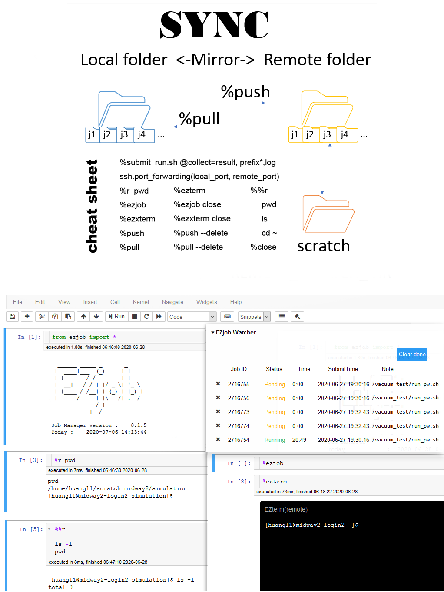

# EZjob

[](https://badge.fury.io/py/ezjob)
[](http://greatfire.uchicago.edu/west-lan/ezjob/commits/master)

> **A Swiss army knife of SSH SFTP for IPython/Jupyter notebook.** <br>
**Get ridge of PuTTY,  MobaXterm once for all. Organize your whole workflow by one jupyter notebook.**<br>
**Run your remote shell at jupyter notebook like local. Manage your remote HPC job submission.Support Port/X11 forwarding.** <br>


 

## Major Jupyter Notebook features
Jupyter magics:
  - %r:   line magic to run remote shell command 
  - %%r: cell magic to run remote shell commands             
  - %ezjob: open EZjob Watcher as a floating pannel
  - %ezterm: open a interactive terminal at current line 
  - %ezxterm: open remote xterm
  - %pull --delete: sync from remote to local, if local files/folder not at remote, delete local copy.  
  - %pull :  sync from remote to local, do not delete files/folders at local but not at remote.
  - %push --delete: sync from local to remote, if remote files/folder not at local, delete remote copy.
  - %push: sync from local to remote, do not delete files/folders at remote but not at local. 
  - %submit run.sh @collect=result.out,job.log : submit job to remote server
  - %close: close all valid SSH instances

rules: 
  -  @choose:  when multi SSH/JobManager instances exist, you can choose underlying instance to run the magic by %magic @choose. For example,"%r @choose". etc.
  -  close:  close is the keyword for %ezjob , and %ezxterm. you can close the EZjob Watcher, remote xterm by typing "%ezjob close", "%ezxterm close".   
 

file/folder sync:
  -  ssh.pull(): pull remote files/folders to local, if ssh.pull(delete=True), local will be exact the same as remote, files/dirs at local not at remote will be deleted.
  -  ssh.push(): push local  files/folders to remote, if ssh.push(delete=True), remote will be exact the same as local,files/dirs at remote not at local will be deleted.
  -  the default value for delete is False
  -  you can also use %pull; %pull --delete; %push; %push --delete    magic functions to do the same thing.

job submission:
  - jm = JobManager(ssh_instance)
  - jm.submit('run.sh',collect=['file1','folder1','prefix*'])
  - auto push when submitting a job, auto push you local files/folder change to remote.
  - auto path translate, local job submit action will auto mirror to the corresponding remote folder, submit at local, run at remote. 
  - collect = ['result.out','result*'...]  copy result files/folders from remote scratch to remote working after job done. keep remote & local working dir small.  
  - If you leave out collect, the default value is '*'.  which means you will copy all files/folders generated by simulation from remote scrach back to remote working dir.
  - If you do not define REMOTE_SCRATCH_DIR in your config file, the REMOTE_WORKING_DIR will be used as scratch, collect option is ignored. 
  - note is optional,jm.submit('run.sh',collect=['file1','folder1','prefix*'],note='your customized note'),if you do not define note, the note for job will be <job_submit_path|collect>.
  - If you define scratch jm.submit('run.sh',scratch='/Your/customized/path'], you will overwrite the default REMOTE_SCRATCH_DIR in config file for this job submission session.
  - %submit run.sh @collect=file1,folder1,prefix*    Easy way is to use the job submission magic. The local path will translate to remote and do the job submission.
  


You project will be organized as follow:

     |-  Notebook.ipynb
     |-  job_log.pickle
     |-  Template1
     |-  ...
     |-  TemplateN
     |-  config.ini
     |-  working_dir
             |- .ezfiles
             |- YOUR_FOLDER
                   |- YOUR_SUB_FOLDER
                   |- YOUR_SUB_FILE
             |- YOUR_FILE
             |- ...
  
`.ezfiles` is auto-generated, it has all info of the working_dir. Trie data structure is adopted to track local files/folder change. It is compressed to string and saved to `.ezfiles`. Also, for every ssh.connect() call,  hidden file `.ezjob.py` is written to REMOTE_WORKING_DIR  `.ezjob.py` is auto called and `.ezfiles` is generated to track file/folder modification at remote. When calling ssh.pull()/ssh.push()   remote `.ezfiles` will be download to local and reconstruct the  files structure info of remote. By comparing remote and local Trie data structure, we then know which file/folder to upload/download/delete/overwrite.

To repeat a simulation project, one only needs  **Notebook.ipynb**, config.ini can be saved as a dictionary in jupyter notebook,  template can also be saved as template string in jupyter notebook . All other files/folders can be auto generated.


> EZjob assume your remote is Linux server with python installed.


       
## Example

 EZjob Uses [xterm.js](https://xtermjs.org) for terminal front-end component. Thanks to [notebook_xterm](https://github.com/adamj9431/notebook_xterm).  [Jinja2](https://palletsprojects.com/p/jinja/) for template rendering.  [Paramiko](http://www.paramiko.org/) for ssh&sftp support. 

For first time user, please create your own SSH connection config file. A template can be found at  \template\config.ini.

```python
from ezjob import *
#the YOUR_PATH/config.ini can also be a dict with keywords listed as key
ssh = SSH('YOUR_PATH/config.ini','YOUR_WORKING_FOLDERNAME')
ssh.connect()
#Template
parameters = {'TEMPLATE_KEY1':'VAL1', 'TEMPLATE_KEY2':'VAL2'}
template=Template('YOUR_TEMPLATE',parameters)
template.write('RUN_SIMULATION.sh')
#all file generated by Template.write() is in unix format.
#if your own file have dos2unix issue. you can run class method:
Template.dos2unix('filename')
#Job manager
jm = JobManager()
#Check current job status
jm.view()
#submit job, no need do ssh.push()  submit will auto push local file/folder change to remote
#submit will translate local path to remote, you run jm.submit at local path, then job is submitted at remote.
#Change dir
%cd YOUR_DESTINATION_DIR
#submit job, if omit collect,all generated files will copy from scratch to working dir.
#scratch is optional keyword for submit(), it will overwrite remote scratch setting in config.ini 
jm.submit('SlurmBashFileName',collect=['result.out','history*.log'])
#this can also be done using magic
%submit SlurmBashFileName @collect=result.out,history*.log
#cancel a job/jobs
jm.cancel(jobid1,jobid2)
#Open EZjob Watercher for remote server job monitoring.
#if refresh_sec is not present, %ezjob will update EZjob Watecher every 5 Sec.
refresh_sec = 1
%ezjob refresh_sec
#Close EZjob Watcher
%ezjob close
#Open remote interactive shell terminal at current jupyter notebook cell.
%ezterm
#Line magic(%r) for executing commands of remote shell
# r for remote
%r pwd
#Cell magic(%%r) for executing commands of remote shell
%%r 
cd ~
ls
pwd
#open the remote jupyter notebook at port 9001 
%r jupyter notebook --no-browser --port=9001 --ip=0.0.0.0 --NotebookApp.token=''
#Port forwarding
local_port = 8000
remote_port = 9001
ssh.port_forwarding(local_port, remote_port)
#now you can open remote jupyter notebook at 127.0.0.1:8000
ssh.stop_port_forwarding()
#%r %%r can not send ctrl+c
#use the ssh.shell() to send ctrl+c
#The code is '\x03'  https://donsnotes.com/tech/charsets/ascii.html
#in order for remote jupyter notebook to quit, you must input <Y> for termination.
ssh.shell('\x03y')
#pull remote files/folders to local
#If delete=True, local files/folders which are not at remote will be deleted.
#Set delete=True, we will have an exact copy of remote at local. 
ssh.pull(delete=False)
#ssh.pull(delete=False) is the same as 
%pull
#local files/folders which are not at remote will be deleted.
%pull --delete
#push local files/folders to remote
#If delete=True, remote files/folders which are not at local will be deleted.
#Set delete=True, we will have an exact copy of local at remote.
ssh.push(delete=False)
#ssh.push() is the same as 
%push
#remote files/folders which are not at local will be deleted.
%push --delete
#When multi SSH instances or JobManager instances exist,
#You can choose which ssh for the JobWaterch by 
%ezjob @choose
#You can choose which ssh for remote interactive terminal
%ezterm @choose
#Same for remote shell ,etc
%r @choose
%push @choose
%pull @choose
#ezxterm for remote xterm x11 forwarding, in Windows, Xming or VcXsrv Windows X Server needed.
%ezxterm
#close remote xterm
%ezxterm close
#choose
%ezxterm @choose
#close a specific ssh connection to remote server 
ssh.close()
#close one or more ssh connections if multi valid ssh instances exisits 
%close
```

For more detailed usage, please go through jupyter notebooks in tutorial folder.

## Comparing with existing tools
Features needed for preprocessing, postprocessing and  HPC job management:
- Interactive execution of python code.  
- Be able to submit and manage remote HPC jobs.
- Have a template system for input files generation.
- Need full SSH capabilities just like PuTTY, MobaXterm ,etc.
- User friendly for pre/post analysis , file preparation and debugging.
- Be able to import other packages for pre/post processing and visualization.

**Threfore, The  only way is to extend jupyter notebook functions, make it capable of managing remote jobs and run remote commands like local. So that we can manage whole job life cycle in one Jupyter Notebook.**

[PuTTY](https://www.chiark.greenend.org.uk/~sgtatham/putty/): Pytty is a free ssh client. It lacks the interactive python code execution ability.<br>
[MobaXterm](https://mobaxterm.mobatek.net/) :MobaXterm is a ssh client. It lacks the interactive python code execution ability too. <br>
[PARSL](https://parsl-project.org/):  Parsl is a parallel programming libaray in python developed at Argonne.  The purpose of parsl is to run python code in parallel.  This needs to rewrite your python code. <br>
[Visual Studio code](https://code.visualstudio.com): VS code with [Remote Development extension](https://aka.ms/vscode-remote/download/extension)  can edit remote files like local. It is suitable for pure remote programming tasks. Not suitable for the entire job workflow management. No interactive execution. 

##  Install
> pip install ezjob

or

>  python setup.py install

Please enable the widget extension for jupyter 

>  jupyter nbextension enable --py widgetsnbextension

##  Template
> template folder for ssh config file template and job submission template, varible to replace is defined by {{val}}.


## Tutorial
> jupyter notebook for tutorial

## Uninstall
> pip uninstall ezjob
 

## License
This project is licensed under the MIT License - see the [LICENSE.md](LICENSE.md) file for details

## Contributing
Pull requests welcome!

Copyright (c) 2020 Lan Huang huangl@anl.gov
 
